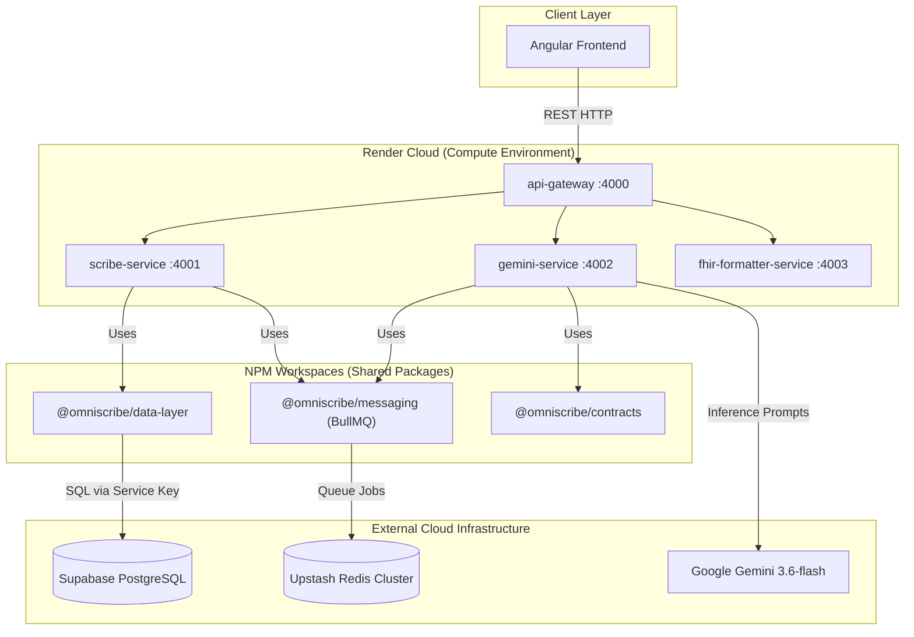
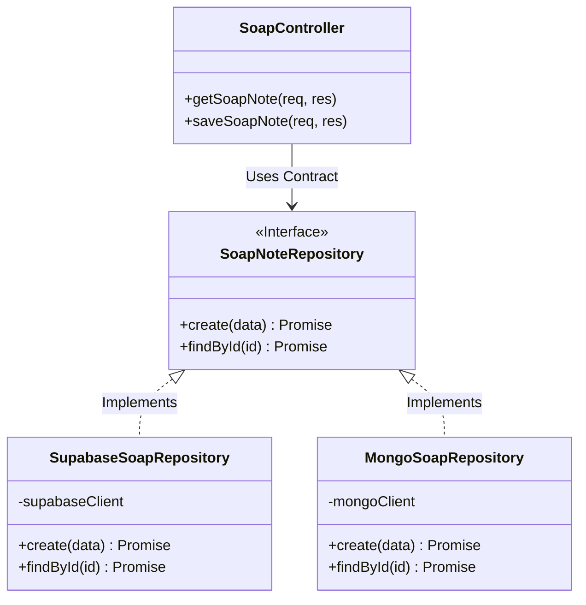

# OmniScribe (AIHM) - Enterprise Backend Architecture & Operations Manual

Welcome to the definitive, Enterprise-Grade Master Architecture Document for the OmniScribe (AIHM) Backend. This repository contains the high-performance, distributed microservices ecosystem that serves as the clinical data engine and AI orchestrator for the platform.

---

## ⚠️ Important Deployment Notice: The "Cold Start" Delay
Because this enterprise backend is currently deployed utilizing **Render's Free Tier** for the hackathon demonstration, the cloud provider enforces a strict resource-saving policy: the web services will automatically spin down (enter "sleep mode") after 15 minutes of inactivity.

If you are evaluating the application after a period of inactivity, **the very first SOAP note generation will take approximately 1 to 1.5 minutes.**
* **The Cold Start Math:** It takes Render roughly **50 seconds** to wake up the Docker containers and boot the Node.js microservices. Once awake, the Google Gemini AI requires an additional **10 to 15 seconds** to ingest the medical transcript, process the complex clinical inference, and return the structured JSON SOAP note.
* **Subsequent Requests:** Once the server is awake, the 50-second wake penalty is eliminated. All subsequent clinical generations will process rapidly (only requiring the standard 10-15 seconds for AI inference). 

---

## 🏗️ 1. Enterprise System Architecture & Flow

The backend is built strictly as a decoupled, distributed system. It leverages an API Gateway pattern to route traffic, async message queues for heavy workloads, and strict boundary separations between business logic and database interactions.

---

## 2. Monorepo Strategy & NPM Workspaces

Rather than building a monolithic server that becomes a tangled web of dependencies, the OmniScribe backend utilizes a **Monorepo architecture powered by NPM Workspaces**. 

The codebase is logically divided into two physical boundaries:
1. `apps/` : The executable microservices (the actual servers).
2. `packages/` : Shared, strictly-typed libraries.

**The Enterprise Benefit:** In healthcare software, consistency is paramount. By housing `@omniscribe/contracts` inside the monorepo, both the `gemini-service` and the `scribe-service` import the exact same TypeScript interfaces (e.g., `PatientContext`, `SoapNoteEntity`). If a schema changes, we update the package once, and the TypeScript compiler immediately alerts every microservice if there is a breaking change. This guarantees absolute type-safety across the entire distributed ecosystem.

---

## 3. Microservices Ecosystem Deep Dive (`apps/`)

If a single service crashes under heavy hospital load, the rest of the ecosystem remains online. Each service serves a singular, specialized purpose.

### 3.1 `api-gateway`
Acts as the central traffic cop. It handles Cross-Origin Resource Sharing (CORS), global rate-limiting to prevent DDoS attacks, and proxies incoming requests from the frontend to the correct internal, isolated microservices.

### 3.2 `gemini-service`
The "AI Brain" of the platform. It is a completely stateless worker. It accepts a raw medical transcript, dynamically injects it into a massive, highly-engineered system prompt, and manages the synchronous and asynchronous communications with the Google Gemini API.

### 3.3 `scribe-service`
The "Core Business Engine." This service manages the actual CRUD (Create, Read, Update, Delete) operations. It handles the creation of clinical sessions, manages users, and acts as the primary orchestrator that commands the flow of medical records in and out of the database.

### 3.4 `fhir-formatter-service`
A highly specialized compliance service. It takes our proprietary JSON SOAP notes and mathematically translates them into strict **HL7 FHIR (Fast Healthcare Interoperability Resources)** JSON standards. This ensures the data can be legally and seamlessly exported to major Electronic Health Records (EHRs) like Epic or Cerner.

---

## 4. Generative AI & Prompt Engineering

Integrating Large Language Models (LLMs) into healthcare requires strict guardrails. An AI cannot be allowed to return conversational text when a clinical database expects a rigid, structured object.

* **Structured JSON Enforcement:** Inside the `gemini-service`, we do not simply ask Gemini to "write a SOAP note." We utilize advanced prompt engineering and **Schema Enforcement**. We force the `gemini-3.6-flash` model to return *only* a valid JSON object matching our exact schema (Subjective, Objective, Assessment, Plan). 
* **Context Injection / Grounding:** The service intercepts the transcript and injects specific "Patient Context." By forcing the AI to evaluate the transcript against the patient's known Age, Sex, and Allergies, the AI is mathematically grounded in reality. This exponentially reduces the chance of clinical hallucinations.

---

## 5. The Data Layer & Repository Pattern (`packages/data-layer`)

In junior-level projects, developers write SQL or Supabase commands directly inside their Express API routes. In OmniScribe, we adhere strictly to the **SOLID Principles** by utilizing the **Repository Pattern**.

All database interactions are isolated inside the `@omniscribe/data-layer` package. The backend controllers simply call `Repository.create(soapNote)`. 

**The Clinical Why:** The core business logic has *absolutely no idea* that Supabase is the underlying database. If a hospital compliance board ever mandates moving away from Supabase to a private AWS RDS instance or an on-premise MongoDB cluster, we only have to rewrite this one isolated package. The hundreds of API routes across the microservices remain completely untouched. 

---

## 6. Asynchronous Message Queuing (BullMQ & Redis)

**The Threat Model:** Processing advanced AI clinical inference takes 10-15 seconds. Keeping a standard HTTP connection open for that duration across thousands of simultaneous providers will result in network timeouts, dropped packets, and frozen User Interfaces.

**The Enterprise Solution (`@omniscribe/messaging`):** We built a robust, fault-tolerant queuing system utilizing **BullMQ** backed by an **Upstash Redis** cluster.

1. **The Producer:** When the frontend requests a SOAP note, the `scribe-service` does not make the user wait. It instantly serializes a `GenerateSoapTask` and drops it into the Redis queue, immediately returning a `202 Accepted` status with a tracking ID.
2. **The Worker:** In the background, the `gemini-service` acts as a highly-concurrent Worker. It pulls jobs off the Redis queue one by one (or in parallel batches), processes the intensive AI inference, and saves the final result directly to the database.

*(Note: For the live Hackathon demonstration, we temporarily configured the frontend to bypass the queue and hit the Gemini service synchronously to make the UI feel faster for the judges, but the heavy-duty asynchronous infrastructure remains fully architected and ready for production deployment).*

---

## 7. Security, Access Control, and Zero-Trust

* **Environment Vaults:** All secrets (Supabase Service Keys, Gemini API Keys, Redis Connection URLs) are strictly isolated from the codebase, injected via `.env` files locally and secure Render Environment Variables in production.
* **The Service Role Key:** Unlike the frontend which utilizes an `anon` key heavily restricted by Row Level Security (RLS), the backend microservices utilize the Supabase `service_role` key. Because the backend is a secure, server-side environment protected by our own API Gateway and JWT validation, it acts as an absolute administrator of the database. This allows background workers to seamlessly read, update, and manage medical records without being blocked by client-side RLS policies, ensuring high-speed data orchestration.
